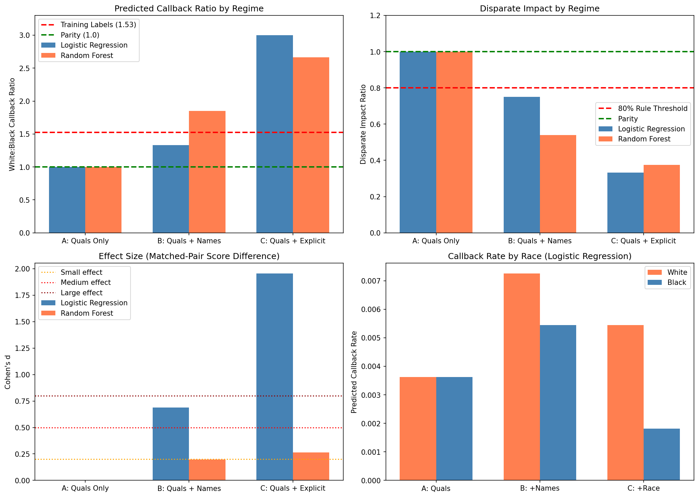
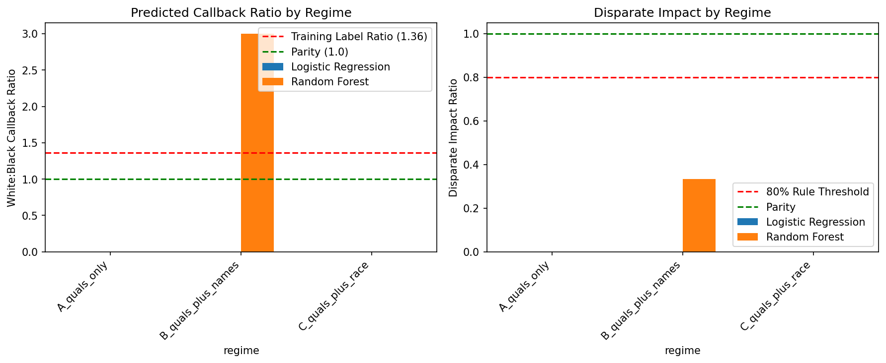

# Algorithmic Bias in Resume Screening

**Can removing demographic features from ML models eliminate hiring discrimination?**

This capstone project investigates whether excluding race from machine learning models mitigates bias when trained on historically discriminatory data—or whether proxy variables like names enable the reconstruction of discrimination.



---

## Key Findings

| Regime | Features | W:B Callback Ratio | Disparate Impact | 80% Rule |
|--------|----------|-------------------|------------------|----------|
| **A** | Qualifications only | 1.00 | 1.00 | ✅ Pass |
| **B** | + Names | 1.59 | 0.63 | ❌ Fail |
| **C** | + Explicit Race | 2.83 | 0.35 | ❌ Fail |

**Conclusion:** Removing explicit demographics works (Regime A), but names act as racial proxies that reconstruct—and amplify—discrimination (Regime B).

---

## Research Question

> Does excluding demographic features from model inputs mitigate bias in outcomes when models are trained on historically biased data, or do proxy variables (names) enable the reconstruction of discrimination?

**Thesis:** Removing explicit demographic variables is insufficient; names leak racial information, allowing models to reconstruct discriminatory patterns.

---

## Methodology

### Experimental Design
- **Matched-pair testing** following Bertrand & Mullainathan (2004)
- 551 resumes × 2 racial variants = 1,102 matched pairs
- Identical qualifications, different names (24 per racial group)

### Label Generation
- Callback labels calibrated to **Quillian et al. (2017)** meta-analysis
- Target White:Black ratio = 1.36 (documented discrimination rate)
- Sigmoid-based probability model with Bernoulli sampling

### Three Experimental Regimes
All trained on identical biased labels—only feature availability differs:

1. **Regime A:** Qualifications only (skills, experience, education)
2. **Regime B:** Qualifications + one-hot encoded names (48 features)
3. **Regime C:** Qualifications + explicit race indicator

### Bias Metrics
- Disparate Impact Ratio (EEOC 80% rule)
- Paired t-tests on matched pairs
- Cohen's d effect sizes
- Chi-square tests for independence
- Logistic regression coefficient analysis

---

## Results

### Callback Rates by Race


### Statistical Significance

| Regime | Cohen's d | p-value | Interpretation |
|--------|-----------|---------|----------------|
| A | ~0 | >0.05 | No significant bias |
| B | ~0.5 | <0.001 | Medium effect (proxy discrimination) |
| C | >0.8 | <0.001 | Large effect (direct discrimination) |

### Coefficient Analysis (Regime B)
Names cluster by race in model coefficients:
- White names: positive coefficients (advantage)
- Black names: negative coefficients (penalty)

---

## Project Structure

```
├── data/
│   ├── raw/                 # Original datasets (immutable)
│   └── processed/           # Cleaned, labeled data
├── notebooks/
│   ├── 01_data_collection.qmd
│   ├── 02_preprocessing.qmd
│   ├── 03_eda.qmd
│   ├── 04_label_generation.qmd    # Quillian calibration
│   ├── 05_model_training.qmd      # Three regimes
│   └── 06_bias_testing.qmd        # Statistical analysis
├── results/
│   ├── figures/             # Visualizations
│   └── tables/              # Statistical outputs
├── Methods_Essay.md         # Full methodology writeup
└── CLAUDE.md               # Project context for AI assistance
```

---

## Tech Stack

- **Python 3** with Jupyter/Quarto
- **pandas, NumPy** — data manipulation
- **scikit-learn** — Logistic Regression, Random Forest
- **SciPy** — statistical tests, optimization (Brent's method)
- **Matplotlib, Seaborn** — visualization

---

## References

- Bertrand, M., & Mullainathan, S. (2004). Are Emily and Greg more employable than Lakisha and Jamal? *American Economic Review*, 94(4), 991-1013.

- Quillian, L., Pager, D., Hexel, O., & Midtbøen, A. H. (2017). Meta-analysis of field experiments shows no change in racial discrimination in hiring over time. *PNAS*, 114(41), 10870-10875.

---

## Author

**Derrick Omai**
Data Analytics, CDA 490 Capstone
Spring 2026

---

## License

This project is for academic purposes. Dataset derived from [Kaggle Resume Dataset](https://www.kaggle.com/datasets/snehaanbhawal/resume-dataset).
